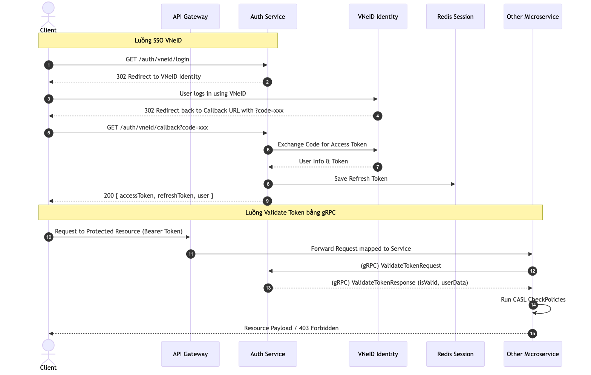
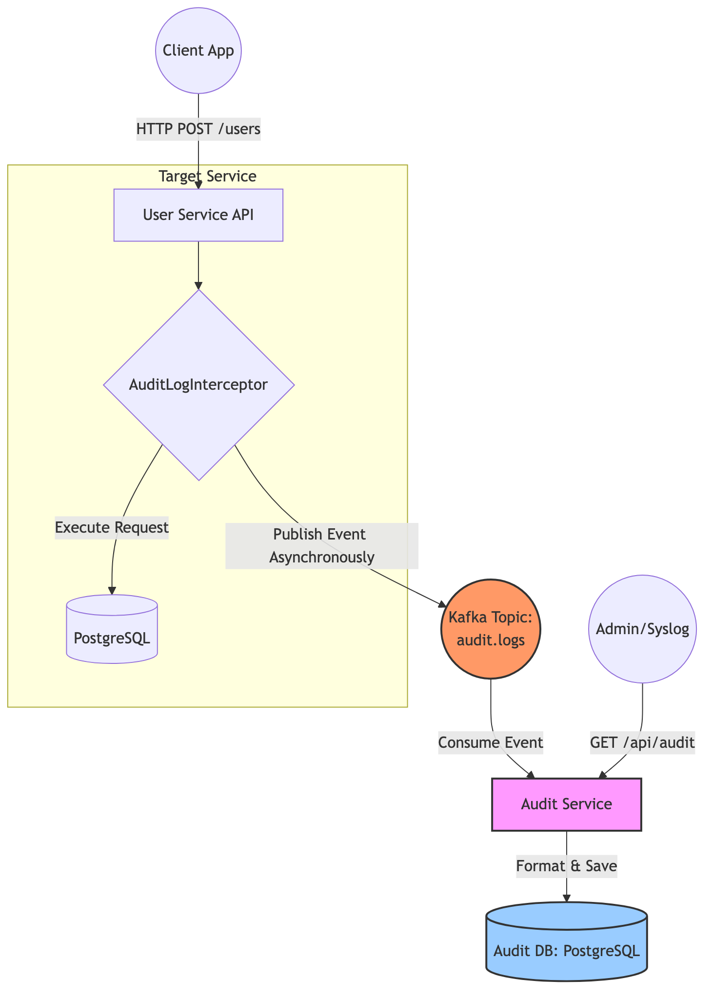
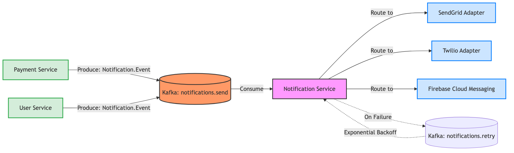

# Base Micro Framework Technical Specification

## 1. Overview & Core Architecture

### 1.1 Mục tiêu
Tài liệu này là cẩm nang chính thức cung cấp các tiêu chuẩn kỹ thuật, kiến trúc cốt lõi, ví dụ code cụ thể và hướng dẫn thực hành (best practices) cho các Backend Developer làm việc trên nền tảng `base-micro`.
Mục đích của tài liệu là thiết lập một bộ quy chuẩn đồng nhất để:
- Tối ưu hóa hiệu suất, khả năng mở rộng (scalability) của hệ thống microservices.
- Đảm bảo tính bảo mật thống nhất qua toàn bộ các service (CASL, JWT).
- Giảm thiểu thời gian thiết lập code (thông qua CLI) và bug trong quá trình phát triển.
- Dễ dàng review code và bảo trì chéo giữa các team.

### 1.2 Tech Stack & Ecosystem
- **Framework Chính:** NestJS (Phiên bản hệ sinh thái mới nhất).
- **Kiến trúc:** Microservices kết hợp.
- **Giao tiếp liên dịch vụ (Cross-service Communication):**
  - **REST API (HTTP/JSON):** Giao tiếp từ Client/API Gateway vào hệ thống các Service.
  - **gRPC (HTTP/2, Protobuf):** Core communication đồng bộ hiệu suất cao, độ trễ thấp giữa các nội bộ microservices (ví dụ: Service A gọi Auth Service để validate token JWT thay vì dùng HTTP làm overhead).
  - **Message Broker (Event-Driven):** Apache Kafka được dùng làm event bus cho các bài toán phân tán, bất đồng bộ và cần khả năng lưu vết hoàn hảo (Ví dụ: `AuditLogInterceptor` luôn đẩy dữ liệu lên Kafka, Notification queue).
- **Database & ORM:** PostgreSQL kết hợp với TypeORM.
- **Caching & Data Storage in-memory:** Redis (Dùng lưu trữ phân tán, session state, rate limit token).
- **Security/Authorization:** CASL (Attribute-Based/Role-Based Access Control).

---

## 2. Getting Started & CLI Usage

Việc tạo mới file bằng tay (Controller, Service, Repository...) **Bị cấm** trong dự án này nhằm duy trì cấu trúc nhất quán. Các script này được định nghĩa tại `package.json` thông qua bộ generator `tools/generators/`.

### 2.1 Các lệnh CLI bắt buộc

Sử dụng lệnh `npm run <tên-script> -- <tham số>`

1. **Khởi tạo cả một Microservice mới:**
   ```bash
   npm run generate:app --name payment-service
   ```
   *Mô tả:* Lệnh này sẽ tự động tạo một project NestJS mới trong thư mục `apps/`, cấu hình sẵn Dockerfile, eslint, tsconfig và main.ts lắng nghe cả port HTTP và gRPC.

2. **Khởi tạo toàn bộ luồng REST API (CRUD):**
   ```bash
   npm run generate:crud --name Product
   ```
   *Mô tả:* Lệnh này tự động tạo Controller, Service, Module, DTOs (Create/Update), và import module vào app. Code được sinh ra sẽ tự động đính kèm Swagger Annotations chuẩn.

3. **Khởi tạo một Endpoint nhỏ lẻ hoặc một Module logic:**
   ```bash
   npm run generate:api --name ProductSearch
   ```

4. **Khởi tạo Background Worker (consume Kafka):**
   ```bash
   npm run generate:worker
   ```

5. **Khởi tạo Cron Job:**
   ```bash
   npm run generate:job
   ```

---

## 3. Communication Protocols & Standards

### 3.1 REST APIs & Swagger Documentation

Mọi API trả về đều phải bám theo các quy chuẩn sau:

**A. Chuẩn phân trang (Pagination)**
Toàn bộ chuẩn phân trang của dự án được đóng gói tại `libs/common/src/lib/pagination`. Không được viết tính toán `skip/take` thủ công.
1. Tại Controller, nhận tham số phân trang bằng `PageOptionsDto`:
   ```typescript
   import { PageOptionsDto } from '@app/common/pagination';

   @Get()
   async getAll(@Query() pageOptionsDto: PageOptionsDto) {
     return this.productService.findAll(pageOptionsDto);
   }
   ```
   *Lưu ý: `PageOptionsDto` đã tích hợp sẵn validate (`page`, `take`, `order: ASC/DESC`) và tự động tính `skip` (`skip = (page- 1) * take`).*

2. Response từ service sẽ trả về `PageDto<T>` và Controller phải dùng Decorator `@ApiPaginatedResponse`:
   ```typescript
   import { ApiPaginatedResponse } from '@app/common/pagination';
   
   @Get()
   @ApiPaginatedResponse(ProductDto) // Dùng ProductDto làm schema model
   async getAll() { ... }
   ```

**B. Controller Decorators & Swagger**
Tất cả endpoint đều **bắt buộc** gắn các Tag của Swagger để gen tài liệu API hoàn chỉnh. Tham khảo trực tiếp từ `AuthController`:
```typescript
@ApiTags('Products') // Bắt buộc
@Controller('products')
export class ProductsController {
  
  @Get()
  @HttpCode(HttpStatus.OK)
  @ApiOperation({ summary: 'Lấy danh sách sản phẩm' }) // Bắt buộc
  @ApiResponse({ status: 200, description: 'Lấy thành công' }) // Bắt buộc
  @ApiBearerAuth() // Đánh dấu nếu API cần Auth Guard
  findAll() { ... }
}
```

### 3.2 Giao tiếp gRPC
Dự án ưu tiên cấu trúc gRPC-first cho các gọi nội bộ API giữa Service to Service (S2S).
- **Khai báo Protobuf:** Tất cả file giao thức phân tán phải được viết tập trung tại `libs/common/src/proto/*.proto`.
- **Thực thi:** Khi compile, file `.proto` sẽ sinh ra Type interface thống nhất của cả Client & Server. 
- **Ví dụ điển hình:** `AuthService` triển khai Method `ValidateToken(token)` qua gRPC để các service khác gửi token lên kiểm tra cực nhanh thay vì gửi HTTP POST.

### 3.3 Event-Driven qua Kafka
Giao tiếp bất đồng bộ qua message queue (RabbitMQ/Kafka) cho phép decouple các dịch vụ.
1. Khai báo schema tại `common/schema` hoặc class DTO.
2. Publish message thông qua module dùng chung `@app/common/kafka`.
   *Ví dụ:* `Notification Service` nhận sự kiện "OrderCreated" để bắn email cho khách.
3. Không tự implement hàm bắt Retry Kafka, hãy dùng các wrapper Decorator đã gói sẵn nếu có hoặc theo sát tài liệu NestJS Microservice.

---

## 4. Database & TypeORM Guidelines

Dự án dùng `TypeORM` với `PostgreSQL`.

**1. Entity / Schema Definition:**
Tất cả class Entity bắt buộc phải define decorators cẩn thận và quản lý index chuẩn xác, file đặt đuôi `.entity.ts`.
```typescript
@Entity('products')
export class ProductEntity {
  @PrimaryGeneratedColumn('uuid')
  id: string;

  @Column()
  @Index() // Cần thiết lập index nếu hay search
  name: string;
}
```

**2. Migration Workflow:**
- Không dùng cờ `synchronize: true` trên production Database!.
- Khi sửa đổi Entity, phải khởi tạo file migration thông qua typeorm cli.
`npx typeorm-ts-node-commonjs migration:generate -d path-to-data-source.ts -n MigationName`

**3. Repository Pattern:**
Không nhúng trực tiếp API TypeORM vào file Controller. Luôn Inject Repository vào tầng `Service` (hoặc tạo Custom Repository) để đảm bảo Controller dễ dàng cô lập và Unit test.

---

## 5. Security & Authorization (CASL)

Hệ thống cung cấp sẵn khả năng uỷ quyền rất sâu qua gói `@casl/ability` thay vì chỉ là check role string khô khan. Toàn bộ nằm trong `libs/common/src/lib/authorization`.

### 5.1 Cấu trúc cơ bản ở Tầng chung
Trong tài khoản đăng nhập (AuthUser payload) sẽ chứa `sub` (user_id), `roles`.
File `AbilityFactory` sẽ dựa vào Role để sinh ra "Khả năng":
```typescript
// Trong ability.factory.ts
if (roles.includes('admin')) {
  can(Action.Manage, 'all'); // Có quyền quản lý tất cả
} else if (roles.includes('user')) {
  can(Action.Read, 'all');
  // Với User thường, chỉ được thao tác Create/Update/Delete nếu thuộc về userId đó
  can([Action.Create, Action.Update, Action.Delete], 'all', { userId: user.sub }); 
}
```

### 5.2 Áp dụng phân quyền trên Controller
Hệ thống cung cấp sẵn `PoliciesGuard`. Khi viết API mới, chỉ cần kết hợp Auth JWT & Decorator CheckPolicies:
```typescript
import { UseGuards } from '@nestjs/common';
import { AuthGuard } from '@nestjs/passport';
import { CheckPolicies, PoliciesGuard } from '@app/common/authorization';
import { Action, AppAbility } from '@app/common/authorization';

@UseGuards(AuthGuard('jwt'), PoliciesGuard)
@Controller('products')
export class ProductsController {
    
  @Post()
  @CheckPolicies((ability: AppAbility) => ability.can(Action.Create, 'Product')) // Phân quyền
  createProduct() { ... }
}
```

### 5.3 Phân quyền tinh chỉnh tại Runtime (Tầng Service)
Đôi khi `CheckPolicies` trên Controller chỉ check quyền cơ bản. Nếu logic nghiệp vụ rẽ nhánh, ta phải check ability thẳng trong code:
```typescript
async updateProduct(user: AuthUser, productData: UpdateProductDto) {
  // 1. Tạo ability cho user hiện tại
  const ability = this.abilityFactory.createForUser(user);
  const targetProduct = await this.repo.findOne(productData.id);
  
  // 2. Ép luật CASL. Nó sẽ tự map "userId" của targetProduct với policy!
  if (!ability.can(Action.Update, targetProduct)) {
    throw new ForbiddenException('Bạn không có quyền sửa đổi sản phẩm này');
  }
}
```

---

## 6. Built-in Core Services
Dự án có sẵn những Service trụ cột làm nhiệm vụ đặc thù chung, cấm viết lại logic nếu hệ thống đã cung cấp.

### 6.1 Auth Service & SSO Workflow
Auth Service xử lý xác thực 2 loại cơ bản: Basic Login & SSO VNeID V2.0. Service này cung cấp thêm gRPC endpoint (`ValidateToken`) để các service khác gọi nội bộ cực nhanh.



### 6.2 Audit Service Workflow
Toàn bộ dự án áp dụng kiến trúc Event-Driven để lưu vết tập trung (Centralized Auditing). Developer viết service nội bộ sẽ gắn `@UseInterceptors(AuditLogInterceptor)` ở các endpoints cần tracking.



### 6.3 Notification Service Workflow
Tương tự Audit, Notification Service xử lý khối lượng lớn tin nhắn mà không làm block API Request của các service khác.



---

## 7. Development & Test Guidelines (Workflow Tổng)

Bất kể bạn nhận được Jira task mới hay luồng mới, hãy tuân theo 7 bước sau:

1. Thiết kế DB (Bổ sung Entity -> Gen Migration).
2. Generate base code `npm run generate:crud --name <entity>`.
3. Định nghĩa Rule mới trong `libs/common/.../ability.factory.ts` nếu Entity mang những thuộc tính không mapping chuẩn theo các role cũ.
4. Triển khai API, bọc Interceptor `AuditLogInterceptor` ở các route đột biến dữ liệu.
5. Viết Test Scripts:
   - **Unit Test**: Test trực tiếp Business Logic trong files `<name>.service.spec.ts`. Mock TypeORM Repo bằng thư viện Jest. Mock gRPC/Kafka. Đạt min 75% Coverage.
   - **E2E Test**: Update tại file `e2e-tester.ts` để check toàn bộ workflow API REST Request > Guard Middleware (CASL) > Controller > Service > Response Format DB. Bắt buộc test status code (200, 400, 401, 403, 404).
6. Viết DTO rõ ràng, đầy đủ `@ApiProperty` để Generate Swagger, kiểm tra localhost Swagger (/api/docs).
7. Mở Pull Request.
